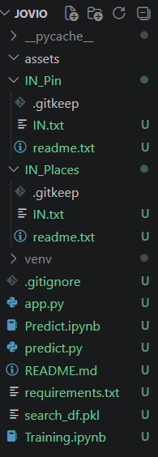
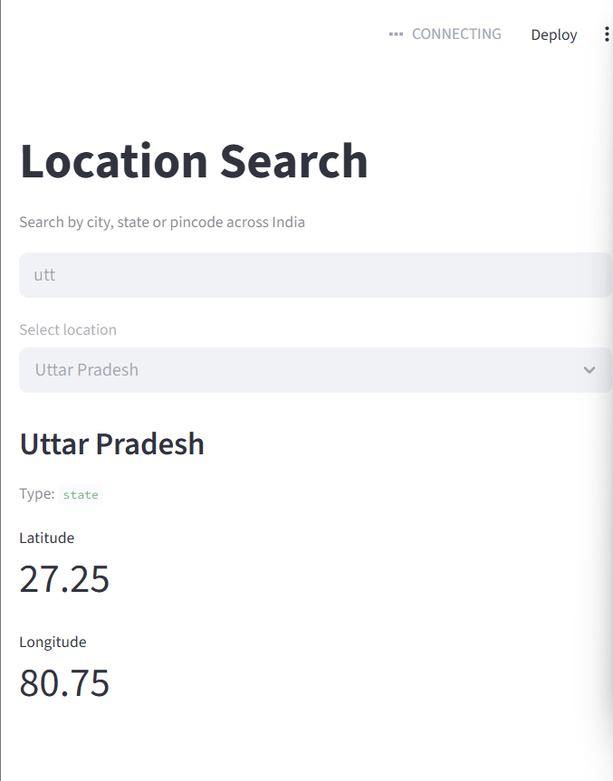

# Location Search — Joveo Case Study

A location search system for a job portal that supports autocomplete for cities, states, and pincodes across India.

## File Structure


```python
JOVIO/
├── Training.ipynb      # EDA + data processing + builds search index
├── Predict.ipynb       # Demo notebook showing search_location in action
├── predict.py          # Core search_location function (importable)
├── app.py              # Streamlit UI
├── search_df.pkl       # Pre-built search index (generated by Training nb)
├── requirements.txt    # Dependencies
├── IN_Places/
│   └── IN.txt          # Geonames Gazetteer data for India
└── IN_Pin/
    └── IN.txt          # India pincode dataset

```


## Setup

```bash
# 1. clone the repo
git clone <repo_url>
cd JOVIO

# 2. create virtual environment
python -m venv venv
venv\Scripts\activate        # Windows
source venv/bin/activate     # Mac/Linux

# 3. install dependencies
pip install -r requirements.txt

# 4. download datasets
# Geonames: https://download.geonames.org/export/dump/IN.zip → extract to IN_Places/
# Pincodes:  https://download.geonames.org/export/zip/IN.zip  → extract to IN_Pin/

# 5. run Training.ipynb to build search_df.pkl
# open Training.ipynb in Jupyter and run all cells
# this generates search_df.pkl (~60MB) locally

# 6. (optional) test search function directly
python predict.py

# 7. run the app
streamlit run app.py

```python
from predict import search_location

results = search_location("west b")   # state
results = search_location("mumb")     # city  
results = search_location("110001")   # pincode
results = search_location("bengaluru") # alternate name
results = search_location("दिल्ली")   # hindi name
```

## How it works

1. **Data loading** — Geonames Gazetteer (cities + states) and pincode dataset
2. **Search index** — each location expanded into multiple searchable terms (name, asciiname, alternate names) — one row per term
3. **Search** — prefix matching using `str.startswith` on the search index
4. **Ranking** — results sorted by population (higher population = more relevant)
5. **Output** — structured JSON with entity_type, entity_name, coordinates, and normalized details


