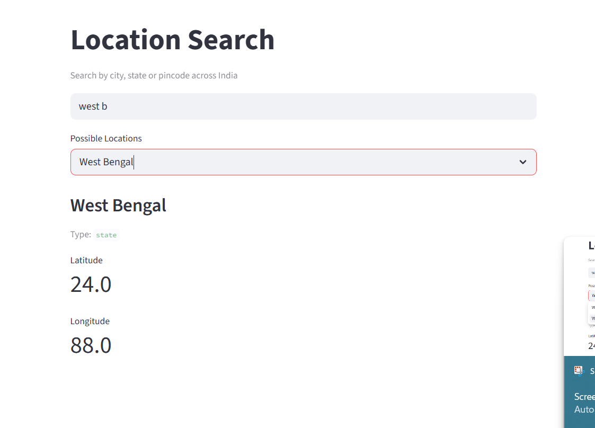
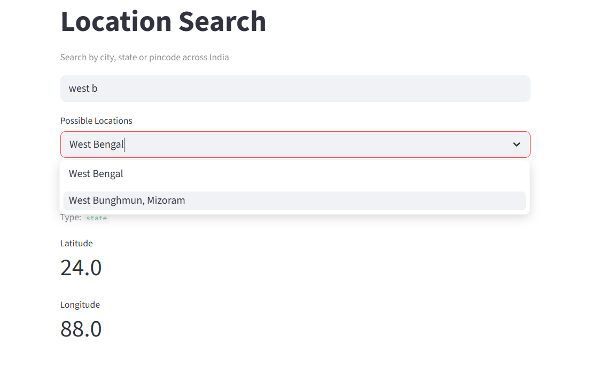
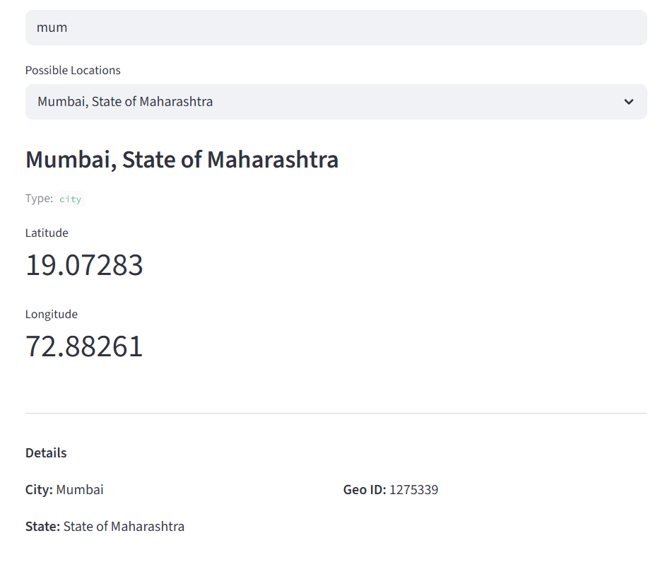
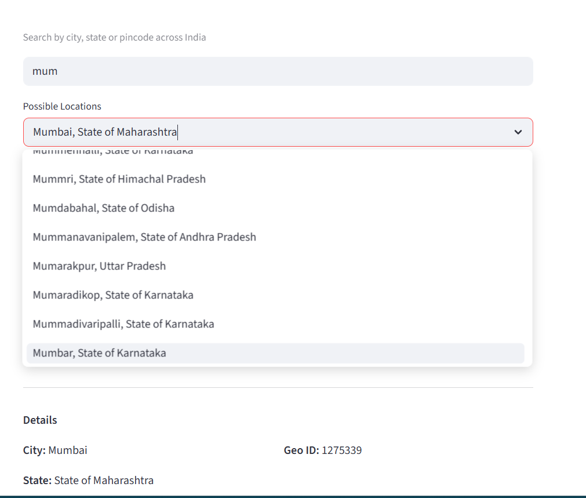
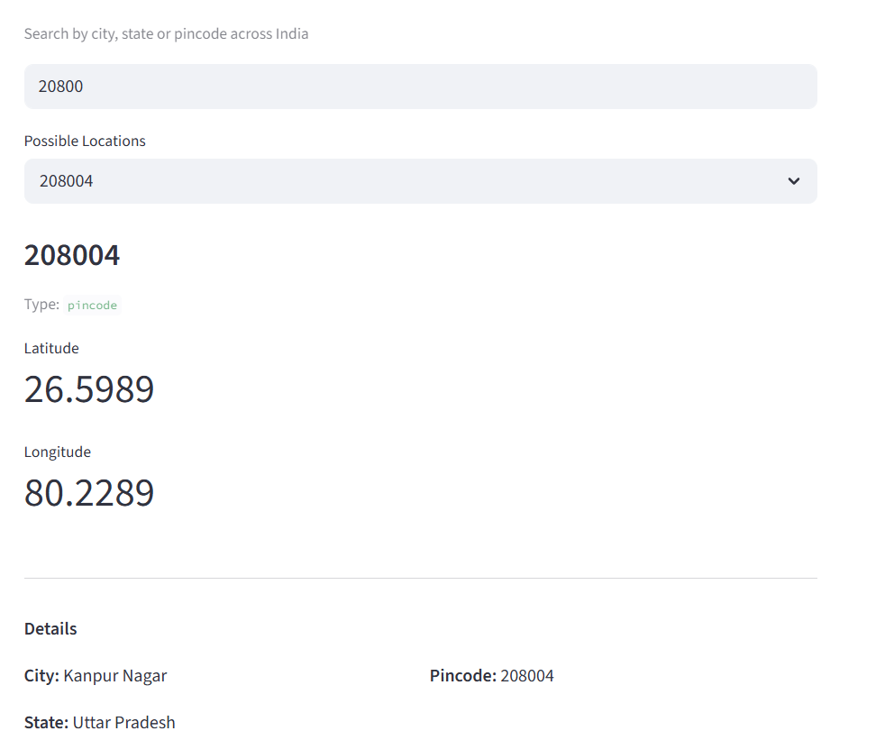
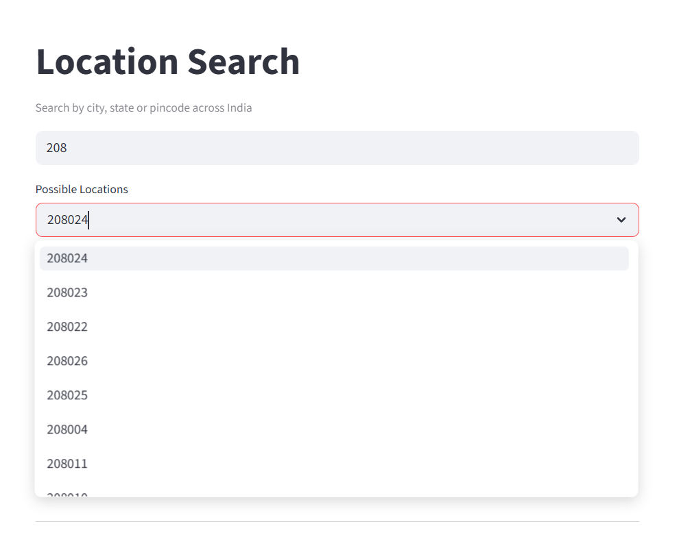

# Location Search — Joveo Case Study

A location search system for a job portal that supports autocomplete for cities, states, and pincodes across India.

## File Structure


```python
JOVIO/
├── Training.ipynb      # EDA + data processing + builds search index
├── Predict.ipynb       # Demo notebook showing search_location in action
├── predict.py          # Core search_location function (importable)
├── app.py              # Streamlit UI
├── search_df.pkl       # Pre-built search index (generated by Training nb)
├── requirements.txt    # Dependencies
├── IN_Places/
│   └── IN.txt          # Geonames Gazetteer data for India
└── IN_Pin/
    └── IN.txt          # India pincode dataset

```


## Setup & Run

> **Note:** This repo uses Git LFS for `search_df.pkl` (~60MB).
> Run `git lfs install` before cloning.

### Option 1 — Local Setup

```bash
# 1. install git lfs (one time only)
git lfs install

# 2. clone the repo (search_df.pkl downloads automatically)
git clone https://github.com/archit2004/location-search-joveo.git
cd location-search-joveo

# 3. create virtual environment
python -m venv venv
venv\Scripts\activate        # Windows
source venv/bin/activate     # Mac/Linux


# 4. install dependencies
pip install -r requirements.txt

> - Download Geonames: https://download.geonames.org/export/dump/IN.zip → extract to `IN_Places/`
> - Download Pincodes: https://download.geonames.org/export/zip/IN.zip → extract to `IN_Pin/`
> - Run all cells in `Training.ipynb`


# 5. run the app
streamlit run app.py
```

### Option 2 — Docker

```bash
# 1. install git lfs and clone
git lfs install
git clone https://github.com/archit2004/location-search-joveo.git
cd location-search-joveo

# 2. build and run
docker compose up --build
# app available at http://localhost:8501
```


## Usage

```python
from predict import search_location

results = search_location("west b")    # state
results = search_location("mumb")      # city
results = search_location("110001")    # pincode
results = search_location("bengaluru") # alternate name
results = search_location("दिल्ली")    # hindi name
```

## How it works

1. **Data loading** — Geonames Gazetteer (cities + states) and pincode dataset
2. **Search index** — each location expanded into multiple searchable terms (name, asciiname, alternate names) — one row per term
3. **Search** — prefix matching using `str.startswith` on the search index
4. **Ranking** — results sorted by population (higher population = more relevant)
5. **Output** — structured JSON with entity_type, entity_name, coordinates, and normalized details








